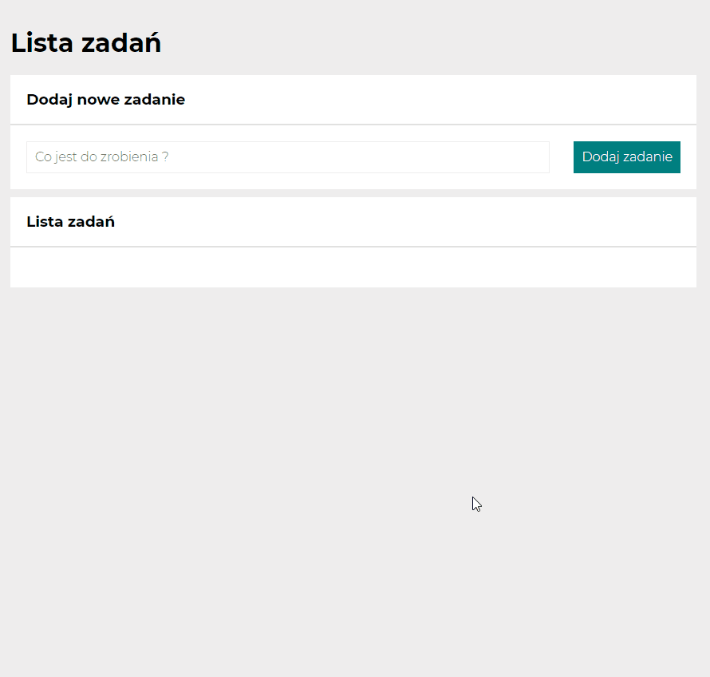

# To do list by Marcin Pankiewicz

## _Created for the course with [YouCode](https://youcode.pl)_
## _You can see how to do list works_  👀[here](https://marcin-pankiewicz.github.io/task-list/)👀

## About app :
It is an ordinary to do list :) 
## Used technologies :
- HTML
- CSS
- BEM
- FLEX
- GRID
- MEDIA QUERIES
- ES6

## Usage :
- Just type the task in task field and press "Dodaj zadanie" button
That's it enjoy :)  

## Animation from working app

 
 