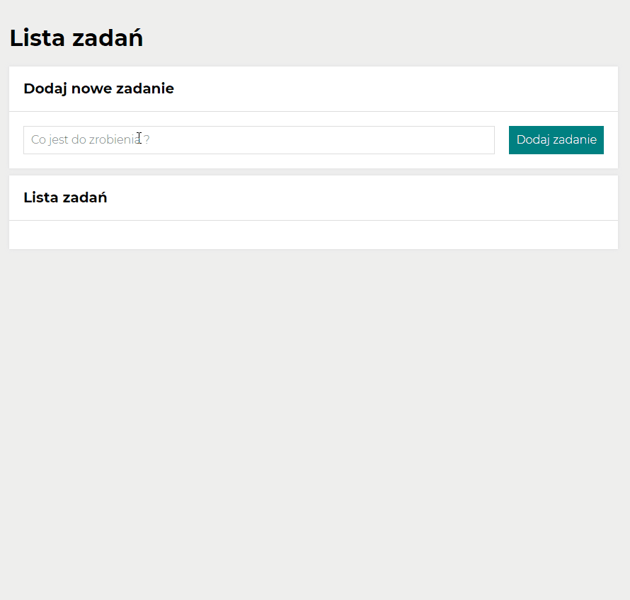

# To do list by Marcin Pankiewicz

## _Created for the course with [YouCode](https://youcode.pl)_
## _You can see how to do list works_  👀[here](https://marcin-pankiewicz.github.io/task-list/)👀

## About app :
It is an ordinary to do list with some simple option like : 
 - Done task select button
 - Erase done task option button
 - Toggling view task done button 
 - Mark all task done button 
 - All done task erase button

## Used technologies :
- HTML
- CSS
- BEM
- FLEX
- GRID
- MEDIA QUERIES
- ES6

## Usage :
- Just type the task in task field and press "Dodaj zadanie" button
That's it enjoy :)  
- Press the green square to finish task or press the red one to delete the task
- Upper menu buttons for more options like : 
- - Show and hide done task 
- - Finish all task 
- - Erase all task 
- - And much more in future :) 

## Animation from working app

 
 